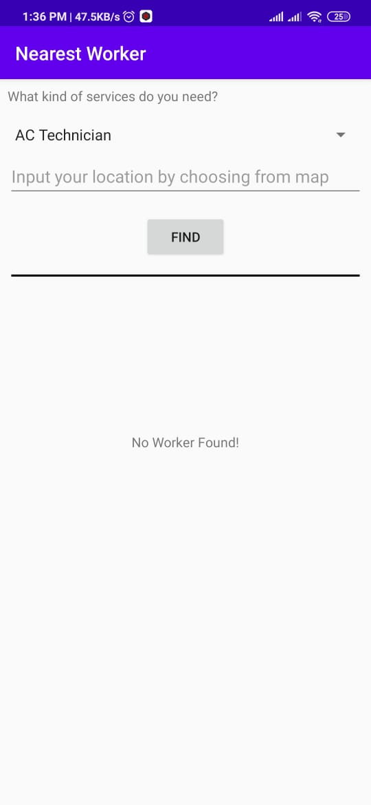
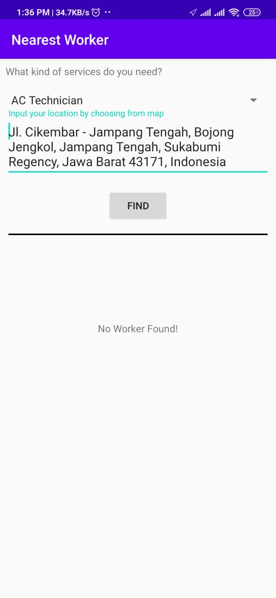
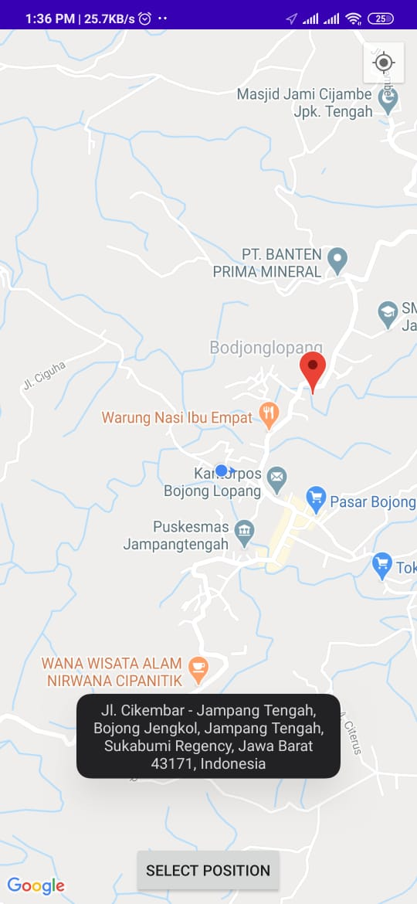
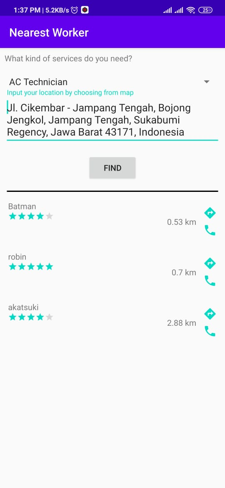
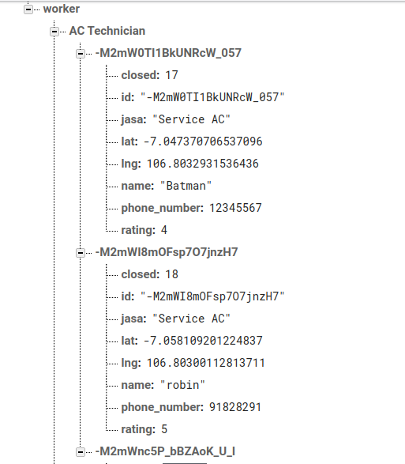

# NearestWorker

Search for nearest worker from database. Sort the list view with the nearest distance of client and worker by latitude and longtitude.

### Screenshots
   

### Database Structure
Here is my database structure, i'm using firebase realtime database for this examples.

### Done
Give some appreciation by clicking star the repo to support the project

### Note

Don't forget to change google maps API_KEY with yours. Change the value inside google_maps_api.xml
